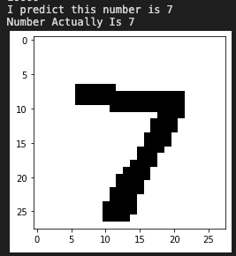
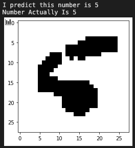

# Handwritten Digit Guesser Neural Network

- Build a basic neural network model with Tensorflow and Keras to train the program to recognize all the handwritten digit in the MNIST dataset

- Test if the prediction is correct on Jupyter Notebook

## Requirements

- Python 3.7
- Tensorflow
- Keras
- Numpy
- Matplotlib
- Jupyter

## Testing our Model





## Give It A Shot!!

- Make sure you have all the packages installed from ```requirements.txt```

```
pip install -m requirements.txt
```

- Build and train the model, and you will get a model directory ```numReader.model```, which will be use for testing later

```
python3 buildModel.py
```

- Use the Jupyter Notebook (```testModel.ipynb```) to test how accurate our model is